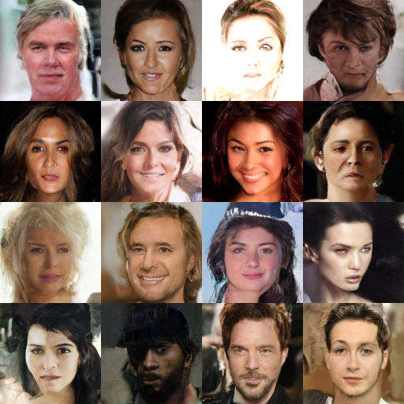

# torch-ddpm — Keras-DDPM 全家桶的 PyTorch 移植

苏剑林 Keras-DDPM 仓库的完整 PyTorch 版,每个文件与上级目录的 Keras 原版逐行对照,面向学习与调试。



*`ddpm.py` 训练 65 epoch(RTX 4090, batch 32)后的 EMA 权重采样,CelebA-HQ 128×128*

## 文件地图(建议学习顺序)

| # | 文件 | 对照原版 | 内容 | 博客 |
|---|---|---|---|---|
| 1 | `ddpm.py` | `../ddpm.py` | 简化 U-Net(Add skip)+ LAMB + EMA + DDPM 训练/采样;含 Min-SNR 开关 | [9119](https://kexue.fm/archives/9119) / [9152](https://kexue.fm/archives/9152) |
| 2 | `ddim.py` | `../ddim.py` | DDIM 采样(eta/stride)+ 球面插值;不用重训 | [9181](https://kexue.fm/archives/9181) |
| 3 | `adpm.py` | `../adpm.py` | Analytic-DPM:解析最优方差(factors 估计 + 修正) | [9245](https://kexue.fm/archives/9245) |
| 4 | `ddcm.py` | `../ddcm.py` | DDCM:codebook 采样 + 图片离散编码/重构 | [10711](https://kexue.fm/archives/10711) |
| 5 | `ddpm2.py` | `../ddpm2.py` | 原论文风味 U-Net(Concat skip、pre-norm、正弦 t 编码、零初始化末层),92M 参数 | [9152](https://kexue.fm/archives/9152) |
| 6 | `ddpm_gau.py` | `../ddpm-gau.py` | GAU Transformer 去噪器(8×8 patch + 2D-RoPE),88M 参数,早期 DiT | [9984](https://kexue.fm/archives/9984)(GAU 基元:[8934](https://kexue.fm/archives/8934)) |
| 7 | `flow_matching.py` | (无) | Flow Matching/Rectified Flow 对照实现(共用 ddpm.py 的 UNet) | [9497](https://spaces.ac.cn/archives/9497) |

依赖关系:`ddim/adpm/ddcm` 复用 `ddpm.py` 训练出的 `model.pt`;`ddpm2/ddpm_gau/flow_matching` 是独立训练的模型(产物分别为 `model2.pt` / `model_gau.pt` / `model_fm.pt`)。

## 用法

```bash
# 训练基础模型(其余采样脚本都依赖它)
DDPM_DATA_DIR=/home/yg/data/CelebA-HQ DDPM_BATCH_SIZE=32 python ddpm.py

# 训练好后(model.pt 存在):
python ddim.py    # DDIM 快速采样 + 插值 → test.png / test_inter.png
python adpm.py    # Analytic-DPM(首次会花几分钟估计 factors,有缓存)
python ddcm.py    # codebook 生成 + 编码重构 → test_ddcm1/2.png
```

| 环境变量 | 默认 | 说明 |
|---|---|---|
| `DDPM_DATA_DIR` | `/root/CelebA-HQ` | 数据根目录(下有 `train/` `valid/`) |
| `DDPM_BATCH_SIZE` | 64 | 24G 显存建议 32 |
| `DDPM_INITIAL_EPOCH` | 0 | >0 从 checkpoint 断点续训(含优化器和 EMA 状态) |
| `DDPM_DEVICE` | 自动 | `cuda` / `cpu` |
| `DDPM_MINSNR_GAMMA` | 0(关) | 设 5 开启 Min-SNR 加权(对照 `../ddpm_yg.py`) |

VSCode 调试配置见 `../.vscode/launch.json`(CPU 小批次 profile 单步很快)。

## 与 Keras 版的对应关系(以 ddpm.py 为例)

| Keras | Torch |
|---|---|
| `residual_block` | `ResidualBlock` |
| 函数式搭建 + `inputs` 栈 | `down_plan/up_plan` 静态推演 + `forward` 里的 `stack` |
| `VarianceScaling(scale,'fan_avg','uniform')` | `variance_scaling_` |
| `l2_loss`(逐像素平方和) | `((noise-pred)**2).sum(dim=(1,2,3)).mean()` |
| LAMB(Norm/bias 不做 layer adaptation) | `LAMB` 类 + 参数分组 |
| `lr_schedule={4000:1,20000:0.5,40000:0.1}` | `piecewise_linear_lr` |
| EMA(0.9999) | `EMA` 类 |

## 已验证(2026-07-14)

- `ddpm.py`:参数量 50,514,176 与 Keras 版**完全一致**;epoch 1 loss 27.5k vs Keras 版 26.8k(跨框架吻合);GPU 训练 5.1 it/s(快于 Keras 版实测的 2.3,依据日志 439ms/step)
- `ddim.py`:eta=0 确定性采样通过一致性测试;真权重端到端加载 OK
- `adpm.py`:方差修正公式冒烟通过
- `ddcm.py`:codebook einsum 形状正确
- `ddpm2.py`:92.5M 参数,前向/反向 OK(曾修复:池化结果漏入栈导致 skip 错位)
- `ddpm_gau.py`:88.5M 参数,patchify↔unpatchify 严格互逆,前向/反向 OK
- `flow_matching.py`:初始 loss ≈ 66k 基准 + 网络初始方差,账目吻合

## 有意的差异(2026-07-15 事实核查后补全)

1. **GroupNorm 分组**:torch 原生连续分块 vs Keras 隔 32 交错——从头训等价,**权重不能互载**
2. **数据加载**:DataLoader 多进程(原版单线程生成器)
3. **断点续训更完整**:checkpoint 含优化器动量与 EMA 影子权重
4. 图片保持 cv2 **BGR** 读写(与原版一致,颜色正确)
5. **LAMB 为紧凑手写实现**,非 bert4keras 逐行等价。另经核查:Keras 原版 `exclude_from_layer_adaptation=['Norm','bias']` 因大小写敏感匹配(权重名是小写 `group_norm/...`)**实际未生效**,即原版对 norm 参数也做了 layer adaptation;torch 版按论文意图真正排除——这是"忠于意图 vs 忠于原版运行时行为"的取舍,选择了前者
6. **EMA 初始化方案不同**:torch 用当前权重初始化影子、无偏差校正;bert4keras 用零初始化 + apply 时 `/(1-m^t)` 校正。**训练前几千步的 EMA 采样两版不等价**,约 3 万步后收敛一致
7. **lr warmup 相位差 1 步**(Keras 首步倍率 0,torch 首步 1/4000),4000 步 warmup 中可忽略
8. `adpm.py` 的 factors 估计:固定 5 个 batch 复用于所有 t(Keras 每个 t 重新抽样),样本量相同、方差略小
9. 未移植 Keras `ddpm.py` 的线性插值 `sample_inter`(DDIM 版球面插值在 `ddim.py` 中)
10. `../ddcm.py` 头部博客号 9245 是原作者笔误(与 adpm 撞号),本仓库标注的 10711(系列(二十九)"用DDPM来离散编码")为 web 核实结果
